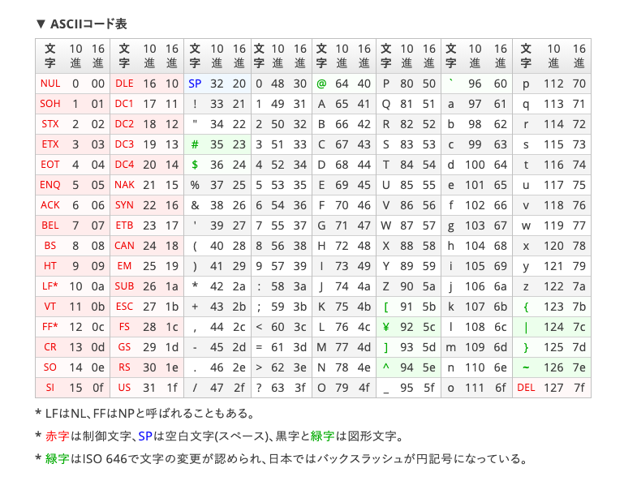
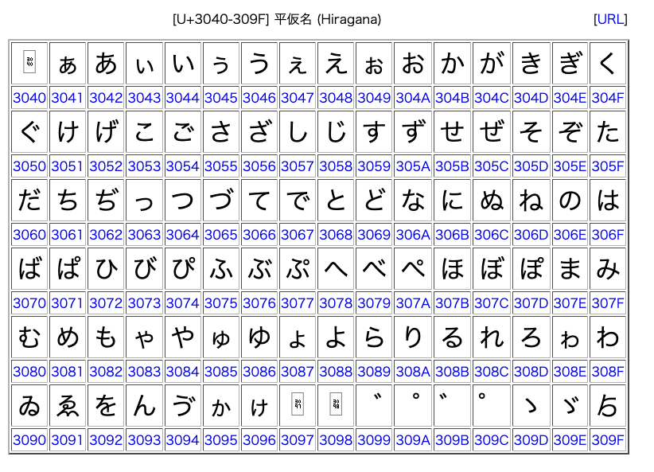
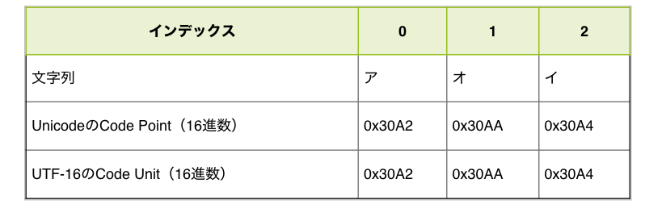
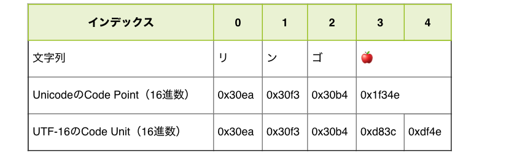

# 新人が知るべき文字コード

JavaScriptやその他の言語で文字列を扱う際に常に考えておかなければならないことが**文字コード**である。  
本ページでは文字コードについて軽く解説し、JavaScriptで文字列を扱う際に特に気をつけてほしい**サロゲートペア**について説明を行う。  

## 文字コードとは

文字コードは、コンピュータ上で文字（キャラクタ）を利用する目的で各文字に割り当てられるバイト表現のこと。    
文字集合を定義し、その集合の各文字に対応するビットの組み合わせを一意に定めた物を文字コードという。  

例えば、  
- 「A」という文字は 1000001  
- 「B」という文字は 1000010  
というルールを定めそのルールで文字をビット列に変換するなどの例が上げられる

## 符号化文字集合と文字符号化方式

- 符号化文字集合とは、符号文字の集合を定め、かつその集合内の文字とビット組み合わせを1対1に関係づける集合
- 文字符号化方式とは、符号化文字集合で文字に対応付けた非負の整数値をバイト列に変換する符号化方式
  - 一般に、ファイル保存や通信で指定する文字コードとは「文字符号化方式」を差す

## 符号化文字集合

- ASCIIコード
 - アスキーコードと読む。
 - 基本的な文字コードであり7bitで1文字を表す。

 

- Unicode
  - ユニコードと読む。全世界で共通して使えるようにするために世界中の文字を収録する。
  - 最大21bitで1文字を表す。
  - 現在割と定番になっている符号化文字集合。

  
  
  [このページ](https://ja.wikipedia.org/wiki/Unicode%E4%B8%80%E8%A6%A7_0000-0FFF)などでどの文字が何に当たるかなどは全て明記されている
  
  - 割り当てられている数値のことを**コードポイント**と言ったりする

## 文字符号化方式

- 符号化文字集合で割り当てられたビット列を、コンピュータが実際に利用できるようにバイト列に変換すること。
- 言語や利用環境に応じていくつかの符号化方式が存在する。
- 一般に**それぞれの変換方式のことを「文字コード」**という

- 文字符号化方式(文字コード)の種類
  - SJIS
  - Shift_JIS
  - UTF-8  
  - UTF-16
など

## JavaScriptと文字コード 

JavaScriptで扱っている文字コードUTF-8, UTF-16の件は以下のJSprimerの記事が分かりやすいので読むべし

- https://jsprimer.net/basic/string/
- https://jsprimer.net/basic/string-unicode/

覚えておいてほしいポイントは

1. 文字リテラル中にUnicodeのエスケープシーケンス`\u`を使って、CodePointでソースコード中に記述できる

  ```javascript
  \u3042 // \u CodePointの16進数の値(2byte分) -> あ
  \u{1f34e} // \u{CodePointの値} -> 🍎
  ```

2. CodePointとCodeUnitの違い
  - CodePoint … Unicode文字に割り当てられた数値
  - CodeUnit … UTF-16で変換された1文字を表すためのバイト列
    - Unicodeに登録されているCodePointは現在10万種類以上であり、全ての文字とCodeUnitを1対1に表せない
    - CodePointが、0x0000 ~ 0xD7FF の範囲ならば、CodePointの値 = CodeUnitの値
  - CodePointが 0xFFFFよりも大きい→**サロゲートペア**

  

  

3. サロゲートペアの扱い
  - 2つのCode Unitの組み合わせ（合計4バイト）で1つの文字（1つのCode Point）を表現。
  - サロゲートペアが含まれる場合文字列の処理が非常に難しくなる
    - **全角だから文字列の長さは2…は通用しない**

    ```javascript
    console.log('あ'.length);  // 1
    console.log('🍎'.length);  // 2
    ```

    - **サロゲートペアが入力されて欲しくない場合はきちんとバリデーションチェックをすること**
    - JavaScriptの文字列のメソッドはCodeUnitの単位で処理されるので、サロゲートペアが含まれる場合ほとんど上手くいかなくなる
    
    ```javascript
    console.log("𩸽".split("")); // ["�", "�"]
    console.log("𩸽"[0]); // "�" -> \uD867
    console.log("𩸽"[1]); // "�" -> \uDE3D
    ```

  - CodePointごとに処理をする場合は、`Array.from()`で文字の配列に変換してから処理

  ```javascript
  Array.from('りんご🍎').forEach(r => console.log(r));
  // り
  // ん
  // ご
  // 🍎
  ```


## UTF-16 <=> UTF-8 変換 

- どちらも文字列をUTF-8符号でエンコードする
- encodeURI…以下の文字以外をエンコードする
  - `A-Z a-z 0-9 ; , / ? : @ & = + $ - _ . ! ~ * ' ( ) #`
- encodeURIComponent…以下の文字以外をエンコードする
  - `A-Z a-z 0-9 - _ . ! ~ * ' ( )`
  - **URI内で意味を持つ#$&+,/:;=?@もエンコードする**
- UTF-8ベースの文字コードに変換する必要がある場合に使用
  - **日本語含みのURLは基本的にエンコードしておくこと**
  - 例: GETリクエストのクエリなど

```javascript
encodeURI("あ")
// "%E3%81%82"
```

- それぞれdecodeURI, decodeURIComponentでデコードできる